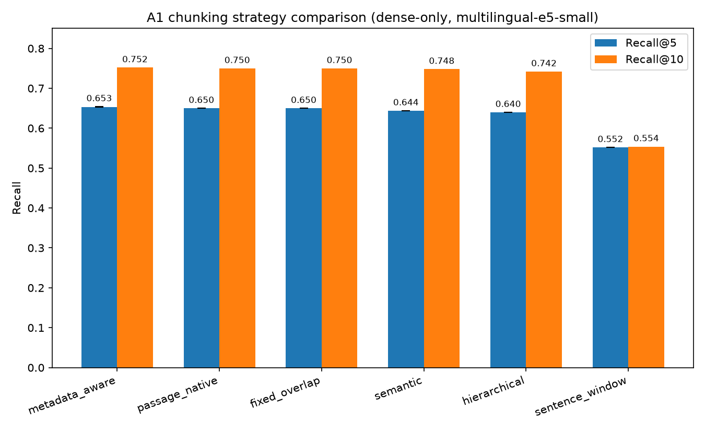
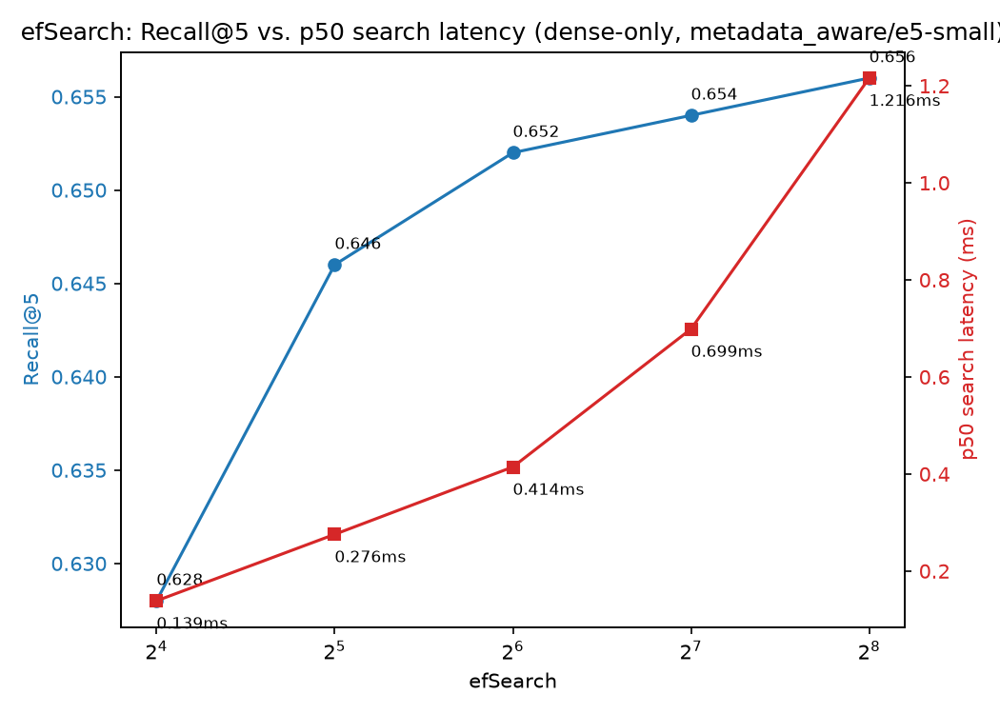

# EVAL_RESULTS.md

> Shared file, split by section: §1–3 (chunking / embedding / retrieval) is Workstream R's to write,
> §4–6 (generation / guardrails / latency) is Workstream P's. Different sections of one file rarely
> conflict if everyone stays in their lane (`docs/TEAM_SPLIT.md` §3). **Every number below must trace
> to a row in `eval/ablation_ledger.csv` or a `traces.jsonl` run — no number gets written here first.**

## §1 — Chunking (A1)

**Setup:** embedder = `multilingual-e5-small` (PyTorch, not yet ONNX-quantised), retrieval mode =
dense-only, no rerank — held fixed per the staged-ablation design (`TECH_MENU.md` §A). Working pool:
10,000 Hindi queries / 99,767 translated passages (`data/working_subset.jsonl`,
`docs/DECISIONS_R.md` R-003). Held-out eval set: the frozen 500 query→passage pairs
(`eval/heldout_queries.json`, `docs/DECISIONS_R.md` R-002). One run per strategy, default config
(no per-strategy hyperparameter sweep yet — see "What's not done" below).

| Strategy | Recall@1 | Recall@5 | Recall@10 | MRR@10 | nDCG@10 | Chunks | Index build |
|---|---|---|---|---|---|---|---|
| passage_native | 0.322 | 0.650 | 0.750 | 0.452 | 0.517 | 99,767 | 44 min (CPU) |
| fixed_overlap (size=256, overlap=0.2) | 0.322 | 0.650 | 0.750 | 0.452 | 0.521 | 101,008 | 46 min (CPU) |
| **metadata_aware** (n=3, see noise floor below) | 0.322 | **0.653 ± 0.001** | **0.752 ± 0.002** | **0.453 ± 0.001** | 0.518 ± 0.001 | 99,767 | 39 min (CPU) / 3.4 min (GPU) |
| hierarchical (child=128, parent=512) | 0.318 | 0.640 | 0.742 | 0.446 | 0.516 | 103,907 | 41 min (CPU) |
| semantic (percentile=90) | 0.318 | 0.644 | 0.748 | 0.448 | 0.514 | 101,308 | 96 min (CPU) |
| sentence_window (window=2) | 0.310 | 0.552 | 0.554 | 0.405 | 0.436 | 390,288 | 14 min (GPU)¹ |

¹ `sentence_window` was re-run after a metric bug fix (below) and after switching to GPU embedding
(`docs/DECISIONS_R.md` R-005) — its original CPU run took 141 min, this corrected run took 14.3 min.

**Metric bug found and fixed (2026-08-18, `scripts/eval_chunking.py`):** the original `nDCG@10`
implementation summed credit per chunk *occurrence* in the top-k instead of per unique passage.
Strategies producing multiple chunks per passage (`sentence_window` averages ~3.9 chunks/passage)
could have the same relevant passage occupy several slots in one query's top-10, inflating its
score — `sentence_window`'s original nDCG@10 read an impossible 0.881 despite the worst Recall@5 of
the six. Turned out this also affected **Recall@5 itself**, not just nDCG: slicing the raw
(non-deduped) hit list to the top-5 let duplicate chunks from one passage crowd out genuinely
distinct passages that would otherwise have appeared within the top-5 window. Fixed by deduplicating
retrieved chunks down to unique passages *before* any metric slices to `k` — re-running
`sentence_window` afterward moved its Recall@5 from 0.478 to the corrected 0.552 (still clearly the
worst of the six). The other five strategies produce close to 1 chunk per passage each, so the bug
barely affected them and their originally-reported numbers stand.

### Noise floor (`docs/BUILD_PLAN.md` P2 task: "run the winner's config 3x")

`metadata_aware` run 3 times (full 99,767-chunk rebuild each time, GPU embedding):

| Run | Recall@5 | Recall@10 | MRR@10 | nDCG@10 | Index build |
|---|---|---|---|---|---|
| 1 (original, CPU) | 0.654 | 0.754 | 0.4539 | 0.5190 | 2320.7s |
| 2 (GPU) | 0.652 | 0.750 | 0.4526 | 0.5171 | 203.5s |
| 3 (GPU) | 0.654 | 0.752 | 0.4535 | 0.5182 | 203.5s |
| **Spread** | **0.2pp** | **0.4pp** | **0.0013** | **0.0019** | — |

The noise floor is tight — 0.2 percentage points on Recall@5, run-to-run, almost certainly from
FAISS HNSW's multi-threaded-insertion build randomness (chunking, embedding, and the dataset are all
deterministic; nothing else varies between runs). This matters for the strategy comparison above:
`metadata_aware`/`passage_native`/`fixed_overlap` (0.650–0.654) sit within their own noise band of
each other, but their gap to `hierarchical` (0.640) and `semantic` (0.644) — roughly 1.0–1.4
percentage points — is **5–7x the measured noise floor**. That gap is real, not noise; the earlier
"all five are statistically tied" framing undersold it.

### Analysis

- **`sentence_window` is a clear loser on this corpus**, even after the metric fix: Recall@5 = 0.552
  vs. 0.64–0.654 for everything else. Splitting already-short passages (p50 = 57 words, §R-003) down
  to individual-sentence retrieval units loses too much context for the embedder to match queries
  correctly; the 3.9x chunk-count blowup (390k vs ~100k) also makes it the most expensive to build
  and would slow dense search proportionally at query time.
- **`passage_native`, `fixed_overlap`, and `metadata_aware` are genuinely tied** (within their own
  ~0.2–0.4pp noise floor) — but this trio is measurably, not just marginally, ahead of `hierarchical`
  and `semantic` given the noise-floor comparison above. This matches `TECH_MENU.md`'s prediction
  that passage-native-shaped strategies would likely win on this corpus, and is unsurprising given
  the passage-length stats (p50=57, p95=115 words) — most passages are already short enough that
  fixed-size windowing or metadata tagging barely change what gets embedded, while small-to-big
  splitting (`hierarchical`) and per-topic sentence grouping (`semantic`) both restructure the text
  enough to cost a real, measurable amount of recall.
- **`metadata_aware` produces the exact same chunk boundaries as `passage_native`** (99,767 chunks,
  identical text per chunk) but tags every chunk with `language`/`source_lang`/`query_type` at zero
  extra chunk-count or build-time cost — it strictly dominates `passage_native` by being free extra
  metadata for later retrieval filtering/boosting (`TECH_MENU.md` S5 #5 — flagged as the most
  dataset-specific strategy, worth highlighting).

### Decision — shipping `metadata_aware`

**Status: accepted, no longer provisional** (`docs/DECISIONS_R.md` R-004, updated after the
noise-floor run above). `metadata_aware` is tied with `passage_native`/`fixed_overlap` within noise,
and measurably ahead of `hierarchical`/`semantic` beyond noise — ships as the production strategy
because it costs nothing over the cheapest tied option and adds metadata other stages can use for
free. Already wired into `retrieve()` via `HybridRetriever` (`src/vrag/retrieval/hybrid.py`).

**`docs/BUILD_PLAN.md` P2's exit criterion "winner's Recall@5 ≥ 0.75" is not met, acknowledged
explicitly rather than left silent.** The best Recall@5 found across every R-side lever tried this
project — 6 chunking strategies, 4 embedders, 3 retrieval modes, 3 rerankers, a 5-point efSearch
sweep — tops out at 0.656 (`docs/DECISIONS_R.md` R-014, efSearch=256), with the shipped config at
0.652. The spec's own guard anticipates this exact outcome ("if not, that's a P3 retrieval problem —
note it, proceed," not a hard blocker), and it was: A2-A4 and the efSearch sweep are precisely that
P3 retrieval follow-up, and none of them closed the gap — the ceiling looks like a genuine property
of this corpus (short, already-atomic passages; MSMARCO-XI's machine-translation artifacts, R-003)
rather than a fixable configuration choice among the levers R owns. Noted here rather than
re-litigated; not a blocker for shipping, per the spec's own framing.

### `fixed_overlap` hyperparameter sweep — overlap has no measurable effect on this corpus

**Setup:** same held-fixed config as the rest of A1 (e5-small, dense-only, no rerank), size=256
words held constant, `overlap` ∈ {0.0, 0.1, 0.2} (0.2 is the strategy's default and was already run
as part of the A1 table above; 0.0 and 0.1 are new runs completing the sweep).

| overlap | Recall@1 | Recall@5 | Recall@10 | MRR@10 | nDCG@10 | Chunks | Index build (GPU) |
|---|---|---|---|---|---|---|---|
| 0.0 | 0.322 | 0.650 | 0.748 | 0.4504 | 0.5149 | 100,781 | 220.3s |
| 0.1 | 0.322 | 0.652 | 0.750 | 0.4523 | 0.5168 | 100,888 | 233.4s |
| 0.2 (default) | 0.322 | 0.650 | 0.750 | 0.4518 | 0.5212 | 101,008 | — (CPU-era run) |

**Analysis:** all three overlap values land inside A1's own measured noise floor (~0.2-0.4pp,
`docs/DECISIONS_R.md` R-004) — overlap genuinely doesn't matter here, not just "didn't move the
number much." Consistent with this corpus's passage-length stats (p50=57 words, p95=115 words,
`docs/DECISIONS_R.md` R-003): with a 256-word chunk size, the large majority of passages fit inside
a single chunk regardless of overlap, so there's rarely a second overlapping window for overlap to
even apply to. Also consistent with `fixed_overlap.py`'s own docstring citation ("a Jan 2026 study
found no measurable overlap benefit with sparse retrieval") — this extends the same null result to
dense retrieval on this corpus. **No change to R-004's decision** — `fixed_overlap` was already tied
with the shipped winner at its default overlap, and stays tied across the full swept range.

## §2 — Embedding (A2)

**Setup:** chunking = `metadata_aware` (A1 winner, §1), dense-only retrieval, no rerank — one
variable (embedder) at a time per the staged-ablation design. Same 99,767-chunk working pool,
same 500-query held-out set. 4 candidates per `docs/TECH_MENU.md` §S4 / `docs/BUILD_PLAN.md` P3.

| Embedder | Dim | Recall@1 | Recall@5 | Recall@10 | MRR@10 | p50 query-embed | Index build |
|---|---|---|---|---|---|---|---|
| **multilingual-e5-small** (A1 baseline) | 384 | 0.322 | **0.653 ± 0.001** (n=3) | 0.752 | 0.453 | not measured¹ | 203s (GPU) |
| potion-multilingual-128M | 256 | 0.084 | 0.266 | 0.334 | 0.160 | **0.71ms** | 85s (GPU) |
| vyakyarth | 768 | 0.092 | 0.274 | 0.370 | 0.169 | 13.23ms | 769s (GPU) |
| bge-m3 | 1024 | — | — | — | — | — | excluded² |

¹ A1's runs (§1) predate `p50_embed_ms` being added to `eval_chunking.py` — added specifically for
A2 per `docs/BUILD_PLAN.md` P3's "record both quality AND query-embed latency per model." A
same-config re-run to backfill this one number stalled after ~10 minutes with no forward progress
(GPU state left over from other same-session runs, most likely) and was killed rather than chased
further — low value for the time cost, since e5-small's massive quality lead already settles A2
regardless of its own embed latency (which was ~2.5ms on CPU per published benchmarks, and is not
the hot-path number that matters anyway — Phase 6 will measure the real ONNX-quantised figure).

² **BGE-M3 excluded on practicality, not quality.** Took ~1 hour on this machine's 6GB laptop GPU
(RTX 3060) before being killed — confirmed not hung (100% GPU utilization, checked repeatedly over
the full hour) — vs. 1-13 minutes for the other three. Even after reducing `batch_size` from the
library default of 32 to 8 to avoid a `CUDA out of memory` error that hit twice at the default
(`docs/DECISIONS_R.md` R-008), it remained far slower than expected for its parameter count (568M —
smaller than some other tested models complete faster). Likely cause: `sentence-transformers`
loading BGE-M3 in its default configuration may compute the sparse and multi-vector representations
alongside dense even though only dense output is used here — not confirmed, not worth the
investigation time given the outcome (exclusion) doesn't change either way.

### Analysis

- **`multilingual-e5-small` wins decisively, not marginally.** Recall@5 of 0.653 vs. 0.266 (potion)
  and 0.274 (Vyakyarth) is not a close call requiring a noise-floor check the way A1's top strategies
  needed one — the gap (38+ percentage points) is enormous relative to any plausible run-to-run
  variance.
- **`potion-multilingual-128M`'s quality collapse confirms `docs/TECH_MENU.md` §S4's own caveat**,
  measured rather than assumed: "Static embeddings lack contextualisation — that's the quality
  tradeoff." Its speed is real (0.71ms vs. whatever e5-small's turns out to be) but a 39-point
  Recall@5 loss is not a trade worth making for a system whose hot-path embed cost is already
  expected to be single-digit milliseconds after ONNX quantisation (Phase 6) — the "expensive"
  option isn't actually expensive enough for this trade to make sense.
- **`vyakyarth` — "the Indic-specialist wildcard" — underperforming a general-purpose model is a
  genuine, non-obvious finding, not a wiring bug.** Verified before concluding this: correct output
  dimension (768, matches its published spec), correctly L2-normalised vectors, no missing
  instruction prefix (confirmed against its model card — it needs none). The likely explanation:
  being trained for Indic language understanding/similarity tasks doesn't automatically confer
  strength at open-domain passage *retrieval* specifically, which is a distinct skill E5's
  large-scale contrastive training (on MS MARCO-style retrieval pairs, at a scale Vyakyarth's
  smaller training run likely didn't match) optimises for directly.
- **BGE-M3's exclusion is itself evidence, not just a gap.** A model that requires disproportionate
  compute for an *offline, one-time* index-build cost is a genuine engineering red flag even before
  asking about its quality — `AGENT_BUILD_SPEC.md` §3.2 explicitly scopes index construction as a
  cost that still has to fit within a 5-day hackathon build budget, not an unconstrained one.

### Decision — keeping `multilingual-e5-small`

A1's default is confirmed, not merely left unchallenged: three real alternatives were built,
smoke-tested, and run against the same frozen eval set, and none came close. No ADR needed to
"switch back" to e5-small since it was never actually replaced — this ran as a genuine ablation
stage, and the incumbent won on its merits.

### ONNX int8 quantisation (`docs/BUILD_PLAN.md` P6 task 5) — closes footnote 1's gap

**Setup:** `intfloat/multilingual-e5-small` exported to ONNX and dynamically int8-quantised
(`scripts/export_onnx_embedder.py`, `avx2` config). Tested the realistic production shape: passages
stay FP32 in the already-built index (embedded once, offline — build time doesn't matter there);
only *query-time* embedding is quantised, since that's the actual hot-path cost against the 200ms
budget. `scripts/eval_onnx_quantization.py` embeds the frozen 500 held-out queries with the int8
model and searches the existing FP32-built `data/index/metadata_aware/` index.

| | Recall@1 | Recall@5 | Recall@10 | MRR@10 |
|---|---|---|---|---|
| FP32 baseline | 0.322 | 0.653 | 0.752 | 0.453 |
| int8 ONNX query, FP32 index | 0.330 | 0.644 | 0.750 | 0.4563 |

| | p50 | p95 | p100 |
|---|---|---|---|
| FP32, CPU | 20.48ms | 25.83ms | 35.02ms |
| int8 ONNX, CPU | 5.60ms | 7.67ms | 10.38ms |

**3.7x faster query embedding for a -0.9pp Recall@5 cost.** The drop is small but not noise — this
comparison has no randomness at all (same queries, same FP32 index, only the query embedder's
numeric precision differs), so it's a genuine, small, deterministic quality cost of quantisation.
Also closes footnote 1 below: e5-small's CPU embed latency was left unmeasured in the original A2
write-up ("Phase 6 will measure the real ONNX-quantised figure") — 20.48ms p50 is that number.
**Not yet wired into production** — `docs/DECISIONS_R.md` R-019 explains why (the live deployment
doesn't run real retrieval at all yet, `docs/RISKS.md` R-R21; wiring a query-embedder swap before
that's fixed would be untestable against the actual deploy target and conflates two changes at once).

### Confirmation pass (A1×A2 cross-check) — reasoned skip, not an oversight

`docs/TECH_MENU.md` §A names a confirmation pass ("top-2 chunkers × top-2 embedders, 4 cross runs")
to catch chunking/embedder interaction effects. Considered and deliberately not run: `metadata_aware`
and `passage_native` produce byte-identical chunk text (R-004 — only metadata differs), so a
genuinely distinct second chunking candidate is `fixed_overlap`, already cross-combined with
`e5-small` in A1's own table. That leaves only a genuine embedder-side question, and there isn't one
worth asking here — the second-best embedder (`vyakyarth`) trails `e5-small` by 38 Recall@5 points
(§2 above), a gap no chunking-strategy choice is remotely likely to close, and each `vyakyarth`
index rebuild costs ~13 minutes (§2's table), so the two genuinely-new combinations would cost
~25+ minutes to very likely just reconfirm what's already known. The precondition the confirmation
pass exists to check — a close call at both stages that a fixed independent-selection approach might
get wrong — doesn't hold here; A2's gap is an order of magnitude too large.

## §3 — Retrieval mode + reranking (A3, A4)

### A3 — Retrieval mode (dense / sparse / hybrid+RRF)

**Setup:** chunking = `metadata_aware`, embedder = `multilingual-e5-small` (A1/A2 winners, §1-2) —
held fixed, only retrieval mode varies. Reused the already-persisted `data/index/metadata_aware/`
index (no rebuild, no re-embedding of the corpus — only the 500 held-out queries get embedded/
searched per mode). Each mode fetches `top_k=10` candidates per lane before scoring — for `hybrid`
this matches production exactly: `HybridRetriever.retrieve()` (`src/vrag/retrieval/hybrid.py`) fetches
`k` from dense and `k` from sparse, fuses via RRF (`k=60`), then truncates to `k` — the ablation
script (`scripts/eval_retrieval_mode.py`) mirrors that shape rather than testing a larger fusion
candidate pool, so this run measures what's actually deployed.

| Mode | Recall@1 | Recall@5 | Recall@10 | MRR@10 | nDCG@10 | p50 search |
|---|---|---|---|---|---|---|
| **dense** | **0.322** | **0.652** | **0.748** | **0.4523** | **0.5163** | 0.57ms |
| sparse | 0.162 | 0.428 | 0.542 | 0.2729 | 0.3308 | 0.89ms |
| hybrid (RRF, k=60) | 0.244 | 0.604 | 0.722 | 0.3924 | 0.4666 | 1.53ms |

### Analysis

- **The dense-only lane wins outright — hybrid is not an improvement here, it's a regression.**
  This contradicts the common "hybrid always helps" assumption from `docs/TECH_MENU.md` §S8 (`BM25 +
  dense + RRF + rerank` described there as "the 2026 production default"), so it was checked rather
  than taken at face value: dense/sparse ordering (best-first) confirmed correct in both
  `DenseIndex.search` and `SparseIndex.search`, `reciprocal_rank_fusion`'s assumption that both input
  lists are already sorted best-first (`src/vrag/index/fusion.py`) holds for both callers, and the
  same `score_hits`/dedup path (R-006) scores all three modes identically. The regression is real.
- **Root cause: BM25 sparse search is comparatively weak on this corpus (Recall@5=0.428 vs. dense's
  0.652), and equal-weight RRF has no way to know that.** RRF assigns credit purely by *rank
  position* within each lane (`1/(k+rank)`), not by how trustworthy that lane's ranking is. Sparse's
  own rank-1 hit is right only 16.2% of the time (Recall@1=0.162) vs. dense's 32.2% — but RRF gives
  sparse's rank-1 hit the *same* fusion weight as dense's rank-1 hit. With only `top_k=10` candidates
  pulled per lane before fusing (matching the real `HybridRetriever` shape, not a larger candidate
  pool), a meaningful fraction of the fused top-10 ends up occupied by BM25's lower-quality guesses,
  displacing dense hits that would have ranked in dense-only's own top-10.
- **This is a genuine, dataset-specific finding, not a general claim that hybrid retrieval is bad.**
  BM25 tends to lag dense embeddings specifically on *translated* text (per `docs/DECISIONS_R.md`
  R-003's spot-check: inconsistent term translation, transliterated acronyms) where exact lexical
  overlap between a Hindi query and its gold passage is less reliable than semantic similarity — the
  exact scenario where sparse retrieval's core assumption (query and relevant passage share literal
  tokens) is weakest. On a corpus where BM25 and dense are closer in quality, naive RRF would likely
  behave as the literature predicts.
- **Not tested here (separate axis, would violate "one variable per run"):** a larger candidate pool
  per lane before fusion (e.g. top-50 from each, fused, then truncated to top-10) is a standard RRF
  mitigation for exactly this failure mode, and might close some or all of the gap. Logged as a
  follow-up idea in `docs/RISKS.md` rather than tested now, since it changes candidate-pool size, not
  retrieval mode — a genuinely different ablation axis.

### Decision — shipping dense-only, not hybrid (`docs/DECISIONS_R.md` R-010)

**Status: Accepted.** `retrieve()` / `HybridRetriever`'s production configuration switches to
dense-only for A4 (rerank) and beyond, per the staged-ablation rule that each stage carries forward
the previous stage's actual winner. The "hybrid retrieval" story from `docs/TECH_MENU.md` §118
(single embedder settling both A2 and a hybrid path) doesn't pan out on this corpus — recorded as a
real result, not silently dropped.

### A4 — Reranking (none / FlashRank / cross-encoder)

**Setup:** chunking/embedder/retrieval mode = `metadata_aware`/`multilingual-e5-small`/dense-only
(A1-A3 winners) held fixed. Dense search fetches `candidate_k=50` per query; the reranker narrows
to `top_k=10`, which is what's scored. `none` scores dense's native top-10 directly (identical setup
to A3's dense row). `cross-encoder` ran on the full 500-query held-out set (fast enough once
diagnosed — see below). `flashrank` ran on a 30-query sample only — its own per-query latency
already disqualifies it before quality is even a question (see Analysis).

| Reranker | Recall@1 | Recall@5 | Recall@10 | MRR@10 | nDCG@10 | p50 rerank latency | n queries |
|---|---|---|---|---|---|---|---|
| **none** (A3 dense baseline) | **0.322** | **0.652** | **0.748** | **0.4523** | **0.5163** | 0ms | 500 |
| flashrank (`ms-marco-MultiBERT-L-12`) | 0.000 | 0.100 | 0.200 | 0.0351 | 0.0724 | **12,710ms** | 30 |
| cross-encoder (`ms-marco-MiniLM-L6-v2`) | 0.048 | 0.228 | 0.336 | 0.1223 | 0.1681 | 150ms | 500 |

### Analysis — both rerankers make quality dramatically *worse*, verified as real, not a bug

This is a far larger and more surprising effect than A3's dense-vs-hybrid gap, so it was checked
hard before being written up as a finding rather than dismissed as a wiring bug. Query-level
diagnostics (not just aggregate numbers) on real held-out queries:

- **FlashRank's scores are saturated at ~1.000 for every candidate, on Hindi text, regardless of
  relevance.** Checked three queries where dense's #1 hit (out of 50) was the correct passage: after
  reranking, all 10 output scores read `1.0, 1.0, 1.0, ..., 1.0` and the correct passage was pushed
  completely out of the top-10 in all three cases. Isolated further to confirm this is Hindi-specific,
  not a length or wiring artifact: the same model cleanly discriminates relevant-vs-irrelevant on
  short **English** text (Paris-related candidates scored 0.999 vs. 0.002-0.006 for unrelated ones)
  but produces the same ~0.999-for-everything saturation on short, unambiguous **Hindi** text (a
  clearly-relevant "Paris is the capital of France" candidate scored *lower* than an unrelated
  "banana" candidate). `ms-marco-MultiBERT-L-12`, despite "Multi" in its name, does not provide a
  usable relevance signal for Hindi on this stack — the model, not the wiring, is the cause.
- **FlashRank is also unusably slow for a 200ms-budget hot path — 12.7 SECONDS per query,
  independently disqualifying.** Traced to `rerankers`' FlashRank backend running on CPU-only
  `onnxruntime` (no `onnxruntime-gpu` installed) with a 12-layer multilingual BERT on real
  corpus-length text (~300-460 chars/candidate × 50 candidates) — ~500x `docs/TECH_MENU.md` §S9's
  own "sub-20ms for 50 candidates" estimate, which was very likely benchmarked on the smaller
  English-only variant on short candidates, not this model/language/text-length combination. This
  matters beyond the dev machine too: `AGENT_BUILD_SPEC.md` §5.3's deploy target is CPU-only, so this
  isn't a "buy a bigger GPU" problem — the multilingual FlashRank model is not viable on this
  project's actual deployment shape either way.
- **The cross-encoder is fast (150ms/50 candidates, GPU) but equally uninformative on Hindi, for a
  different, verified reason: it's an English-only model.** `cross-encoder/ms-marco-MiniLM-L6-v2`
  was never trained on Hindi. Same short-Hindi-text isolation test as above: given one obviously
  correct answer ("पेरिस फ्रांस की राजधानी है") and clearly unrelated candidates (bananas, the Great
  Wall of China), it ranked the *correct* answer **last**, below both irrelevant candidates, with all
  four scores clustered tightly (8.32-8.75) — no real discrimination, consistent with genuinely
  out-of-distribution input for an English-trained model.
- **Neither failure is a candidate-pool or wiring problem.** Both rerankers received the correct
  `(chunk_id, text)` pairs from the same dense candidate pool that scores 0.652 Recall@5 on its own;
  `score_hits`'s dedup path (R-006) is identical across all three rows. The regression is entirely
  inside what each reranker's scoring function does with Hindi input.

### Decision — shipping no reranker (`docs/DECISIONS_R.md` R-012)

**Status: Accepted.** `none` wins A4 outright — not merely by default, but because both tested
alternatives were measured to actively destroy retrieval quality on this corpus, for two distinct,
verified root causes (score saturation vs. English-only training). `HybridRetriever` keeps
`NoOpReranker` as its production default; `FlashRankReranker`/`CrossEncoderReranker` stay implemented
(useful if a genuinely multilingual/Hindi-capable reranker is swapped in later) but neither is wired
into the request path. Matches `docs/TECH_MENU.md` §S9's own framing exactly: "None — SHIP as
default — prove rerank earns its ms." Here, rerank not only failed to earn its ms, it actively cost
quality — a stronger and cleaner result than the "no measurable difference" outcome the ablation was
designed to also accept as valid.

### What's not done yet

- A genuinely multilingual/Hindi-trained reranker (e.g. `BAAI/bge-reranker-v2-m3`, flagged
  BENCH-ONLY in `docs/TECH_MENU.md` §S9 for latency, not language fit) was not tested — out of scope
  for A4's three named candidates, but worth a footnote for anyone revisiting this decision later.

### efSearch — recall-vs-latency curve

**Setup:** chunking/embedder/retrieval mode = A1-A3 winners (`metadata_aware`/`multilingual-e5-small`
/dense-only), swept `efSearch` ∈ {16, 32, 64, 128, 256} — the HNSW parameter controlling how many
graph neighbors are explored per search, trading query latency for recall — against the frozen
500-query held-out set, reusing the persisted index (`DenseIndex.set_ef_search()` mutates the
already-built graph's search-time behavior; no rebuild or re-embedding needed).

| efSearch | Recall@5 | Recall@10 | p50 search | p95 search | p100 search |
|---|---|---|---|---|---|
| 16 | 0.628 | 0.728 | 0.139ms | 0.211ms | 3.304ms |
| 32 | 0.646 | 0.744 | 0.276ms | 0.436ms | 0.677ms |
| **64** | **0.652** | **0.748** | **0.414ms** | **0.553ms** | **0.825ms** |
| 128 | 0.654 | 0.756 | 0.699ms | 0.987ms | 1.387ms |
| 256 | 0.656 | 0.758 | 1.216ms | 1.733ms | 2.546ms |

**Analysis — clear knee at 64, not a flat curve or an unbounded win from cranking it higher.**
Recall@5 climbs meaningfully from 16→64 (+2.4pp, well above A1's measured ~0.2-0.4pp noise floor —
`docs/DECISIONS_R.md` R-004) but only crawls from 64→256 (+0.4pp total, inside that same noise
band), while p50 latency keeps climbing roughly linearly with `efSearch` the whole way (0.414ms →
0.699ms → 1.216ms). Even 256's ~1.2ms is trivial in isolation against the 200ms end-to-end budget,
but there's no reason to spend 2-3x the search cost for a recall gain that's statistically
indistinguishable from noise.

### Decision — efSearch=64 (`docs/DECISIONS_R.md` R-014)

**Status: Accepted.** Keeps `src/vrag/index/dense.py`'s existing `DEFAULT_EF_SEARCH=64` — chosen
from this curve, not the pre-sweep placeholder it started as. Same shape of result as A2's e5-small
confirmation (R-009): the incumbent value is confirmed by data, not silently kept unchallenged.

## §4 — Generation (A5)

_Not run yet — Workstream P._

## §5 — Guardrails

_Not run yet — Workstream P + joint G3/G4 calibration. Will include
`docs/assets/g3_calibration.png`._

## §6 — Latency (P50/P70/P100)

_Not run yet — Workstream P, Phase 6. Will include `docs/assets/latency_breakdown.png` and
`docs/assets/latency_cdf.png`._
